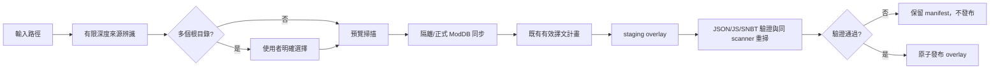

# KubeJS／FTB Quests 流水線（`kubejs_ftb_pipeline`）

入口：`app/views/kubejs_ftb_pipeline_view.py`。

側欄的「KubeJS / FTB 流水線」頁與任務翻譯頁的 FTB Quests、KubeJS Tooltips 分頁使用同一個元件與同一套流程。

這一頁是模組包根目錄 overlay 工作流，不是 Resource Pack 打包器。它沿用
`pack_sources.scan_pack_sources`、ModDB `TranslationDB` 與
`pack_output.export_pack_overlay`，因此不另建資料庫、也不執行來源內的 JavaScript。

## 使用流程


```mermaid
flowchart LR
  A[輸入路徑] --> B[有限深度來源辨識]
  B --> C{多個根目錄?}
  C -- 是 --> D[使用者明確選擇]
  C -- 否 --> E[預覽掃描]
  D --> E
  E --> F[隔離/正式 ModDB 同步]
  F --> G[既有有效譯文計畫]
  G --> H[staging overlay]
  H --> I[JSON/JS/SNBT 驗證與同 scanner 重掃]
  I --> J{驗證通過?}
  J -- 否 --> K[保留 manifest，不發布]
  J -- 是 --> L[原子發布 overlay]
```

## 根目錄與輸出契約

來源可直接選模組包根、`kubejs`、`config` 或解壓後的 wrapper。探索最多四層，
拒絕 symlink、junction 與其他 reparse point；多個候選不會取第一個，也不會合併。
輸出固定相對模組包根目錄：

```text
<overlay>/kubejs/assets/<namespace>/lang/zh_tw.json
<overlay>/kubejs/client_scripts/<relative>.js
<overlay>/config/ftbquests/quests/<relative>.snbt
<overlay>/config/ftbquests/quests/lang/<target-locale>.snbt
```

`config/ftbquests` 與原始 `kubejs/*.js` 不會放入 Resource Pack ZIP。每次執行
會建立 `run_id`、`pack_scope`、kind 統計、問題明細、輸出計畫與驗證結果的
`manifest.json`（放在 app 資料根目錄的 `pipeline_runs/<run_id>/`，與 config、快取同一處，不會在來源或輸出目錄旁留下資料夾），並分開寫入 `metadata/source_mapping.json`、
`metadata/translation_plan.json`、`reports/scan_report.json`、
`reports/coverage.json`、`reports/execution.json`、`reports/format_issues.json`、
`reports/writeback_diff.json`。每筆來源 mapping 都包含 selector、source hash 與
overlay target path。手動步驟 2 的預覽使用 SQLite 唯讀連線；填了輸出目錄時會在系統暫存目錄完整產生與驗證 overlay（沒填輸出目錄就只預覽同步計畫）；正式執行先 staging，通過來源 hash、
selector、檔案格式與重掃驗證後才發布。

執行可選「完整掃描（非破壞同步）」或「增量同步（只處理來源 hash 變更）」。
兩者都使用同一套 scanner／ingest；完整模式不刪除有效翻譯，增量模式只略過已存在
且來源身份與 hash 完全相同的條目，仍會保留完整掃描 coverage。

## 介面與步驟

頁面版面與「一鍵製作」相同：左欄為「專案路徑」與「流水線步驟」，右欄為「執行狀態」與日誌。

- 專案路徑：讀取來源（模組包根目錄）。分析來源後，候選根目錄與 overlay 輸出目錄在一鍵執行的精靈中設定。
- 流水線步驟：每一步有獨立的「執行」按鈕。
  1. 分析來源：只做候選探索，不寫入。
  2. 預覽同步計畫：dry-run，唯讀開啟 ModDB，不寫入資料庫。
  3. 同步 ModDB：寫入來源條目與 manifest；不輸出 overlay 檔案。
  4. 輸出 overlay：正式發布，需先通過同一 scanner 的驗證。
- 一鍵執行（標頭金色按鈕）：開啟三步設定精靈（1/3 → 3/3）。輸出目的地（overlay 輸出目錄）與讀取來源一樣放在頁面的「專案路徑」卡，未填時，精靈最後一步的「確認並執行」會擋下並提示。
  1. 來源與來源類型：有效來源根目錄（多個候選時必須選擇）、同步模式（完整／增量）、
     KubeJS／FTB Quests 來源類型。未分析來源、多個候選未選或來源類型都未選時不能前進。
  2. 翻譯設定：「LM 翻譯待處理」開關（一鍵執行會直接翻譯並發布）與「讀取 zh_cn 語系檔」勾選（預設值取自設定 `translator.pack_read_zh_cn`，預設開；關閉後掃描來源時不讀 zh_cn，只用 en_us 與 zh_tw，只影響本次掃描，DB 內先前由 zh_cn 建立的條目與譯文照舊保留並輸出；第 3 步摘要會列出此選項）。
     「遊戲版本」只在這一步選擇一次，同時是 ModDB 版本與 LM 目標版本，不再有獨立的全域版本沿用開關。下拉只列資料庫已有的版本，不能手動輸入新版本；分析來源時會從來源資料夾或 zip 內的
     `manifest.json`、`modrinth.index.json`、`mmc-pack.json`、`minecraftinstance.json`、`instance.cfg` 偵測版本並預選。使用者自選的版本不會被之後的偵測覆蓋。未選版本時不能前進。偵測到的版本即使資料庫還沒有也會預選並列入選項（同步 ModDB 時才建立）。手動步驟（預覽／同步）也使用這裡選的版本，所以精靈不要求先填輸出目的地；輸出目的地未填時擋在最後一步。
  3. 確認並執行：列出以上設定，按「確認並執行」直接以 `dry_run=False, publish=True` 執行：
  掃描來源、同步 ModDB、LM 翻譯（若啟用），再於輸出目錄旁的 staging 產生 overlay，通過來源 hash、
  重掃描驗證後才發布。一鍵流程沒有獨立預覽；overlay 階段的各步驟（規劃、來源驗證、寫入暫存、重掃描、
  發布）都會寫進畫面日誌。

## 翻譯與責任邊界

本頁負責來源覆蓋率、DB 同步、既有有效譯文回寫與輸出證據。啟用 LM 翻譯時，
同一個流水線 session 會呼叫共用 ModDB 翻譯入口（與模組包一鍵製作使用同一套批次、
快取與格式診斷），不在此頁複製第二套翻譯引擎。Smart Review 仍在既有校對頁處理。

合法跳過、unsupported、parse failure 與 selector conflict 都留在 manifest／DB
問題紀錄，不計入已完成回寫，也不以成功檔案數冒充逐條驗證成功。
